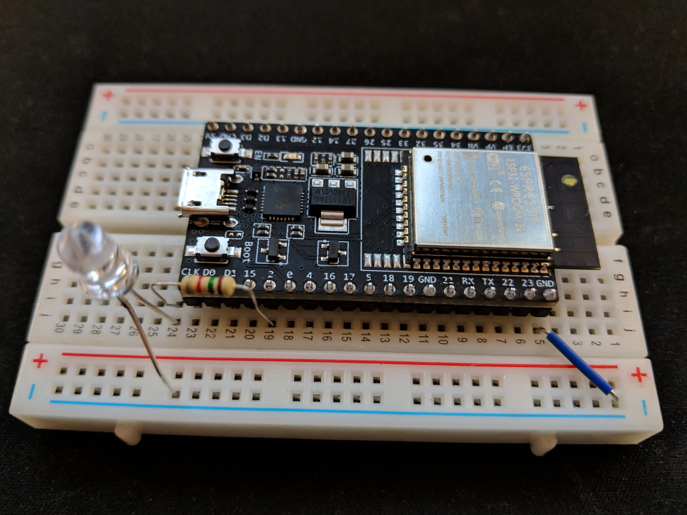

# Reagere på meldinger

I `app1/fs/init.js` finner vi eksempelkoden som kjører på dingsen. Let spesielt etter

```
MQTT.pub(topic, message, 0 /* QoS */);
```

som er funksjonen som sender meldinger på MQTT-bussen.

## Oppgave 1

Endre topic for MQTT.pub til `/state`.

Meldingen som sendes er state-objektet som er definert i koden. I tillegg til å øke `btnCount` ønsker vi å endre variabelen `on` i state-objektet.

Når knappen trykkes, skal ```on``` settes til vekselsvis ```true```eller ```false```. Mao:
 - hvis man state er ```true``` og knappen trykkes, settes ```on``` til ```false```.
 - hvis man state er ```false``` og knappen trykkes, settes ```on``` til ```true```. 

## Oppgave 2

Legg til funksjonalitet for å lytte på MQTT-meldinger (på ```/state```), på samme topic som vi satte over.
Skriv ut meldingen slik at den dukker opp i loggene i mos.

## Oppgave 3

Finn en kollega som du kan utføre de neste tre oppgavene med. Ta med dingsen din.

Grunnen til at du skal gjøre oppgavene med en kollega er at dere må jobbe på samme AWS-konto. Velg en maskin og koble begge dingsene til den.

Vi skal koble en lysdiode til én av dingsene. Den andre skal ikke tukles med.

Koble en lysdiode til pinne 2 på dingsen. Lysdioden trenger en motstand i serie for å ikke brenne opp. Det lange beinet på lysdioden kobles mot motstanden. Det korte beinet kobles til jord (GND).



## Oppgave 4

Vi vil skru lysdioden av og på i samsvar med `on`-variabelen vi mottar i state-objektet. Pinne 2 som vi har koblet lysdioden til er en General Purpose Input/Output pinne (GPIO). 

[I dokumentasjonen for GPIO](https://mongoose-os.com/docs/mongoose-os/api/core/mgos_gpio.h.md#js-api) kan vi finne metoden `GPIO.write`. Bruk denne for å reflektere state på lysdioden.

## Oppgave 5

Trykk på knappen på dingsen som ikke har en lysdiode koblet til seg og nyt hvor komplisert man kan gjøre det å skru en lampe av og på.
