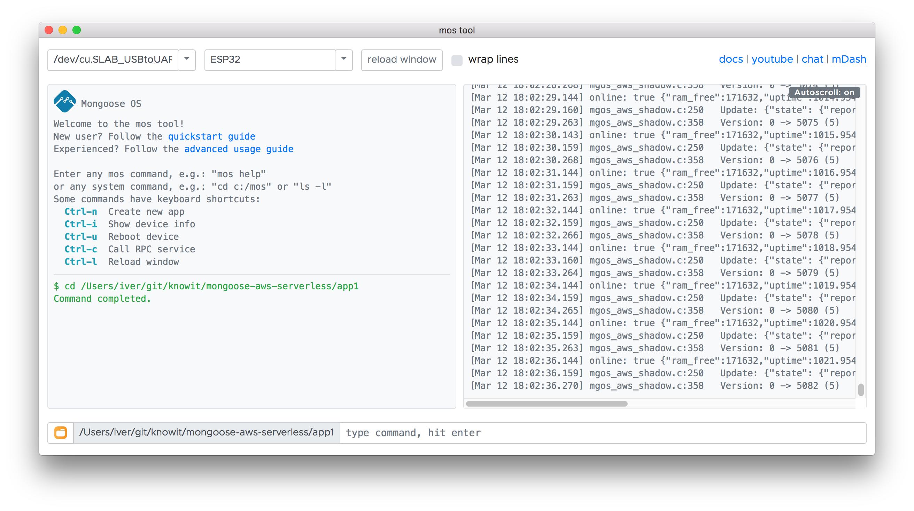
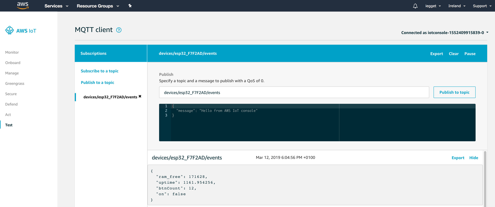

## Mongoose OS

Vi bruker programmet `mos` fra terminalen for å flashe firmware til dingsen og for å sette opp koblingen mellom dingsen og AWS.

[Følg instruksene her for å installere mos](https://mongoose-os.com/docs/mongoose-os/quickstart/setup.md).

Appen vi skal utvikle får vi så og si gratis. Den legger du inn ved å skrive

```
$ mos clone https://github.com/mongoose-os-apps/demo-js app1
$ cd app1
```

Vi må gjøre en liten justering i konfigurasjonen for å få appen til å fungere.
I `mos.yml` legger du til

```
build_vars:
  APP_SLOT_SIZE: 0x190000
```

Vi kompilerer appen

```
$ mos build --platform=esp32
```

og flasher dingsen

```
$ mos flash
```

Dingsen må ha parametere for Wifi. Disse setter vi ved å skrive 

```
$ mos wifi knowit-workshop QuantumDot # wifinavn er knowit-workshop og passordet er QuantumDot
```

Vi må deretter konfigurere dingsen for AWS

```
$ mos aws-iot-setup
```

Dingsen vår blir opprettet i AWS og sertifikater synkroniseres

```
$ aws iot list-things
{
    "things": [
        {
            "thingArn": "arn:aws:iot:eu-west-1:057359675476:thing/esp32_F7F2AD",
            "version": 1,
            "thingName": "esp32_F7F2AD",
            "attributes": {}
        }
    ]
}
```

Vi kan nå åpne mos i grafisk modus og se på logger fra dingsen

```
$ mos
```



Om man trykker på knappen til høyre for USB-kontakten (Boot) sendes det en melding fra dingsen til skyen. Meldingen og kanalen den blir sendt på vises i loggene i mos.

Vi kan se på meldingene i AWS-konsollen ved å søke opp AWS IoT og gå til `Test`.



