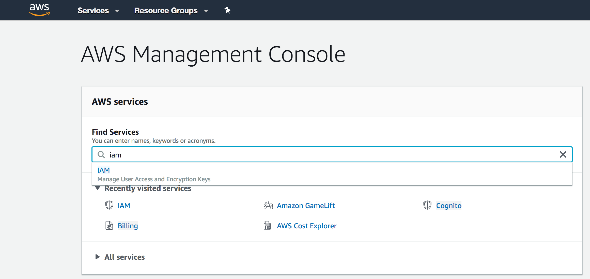
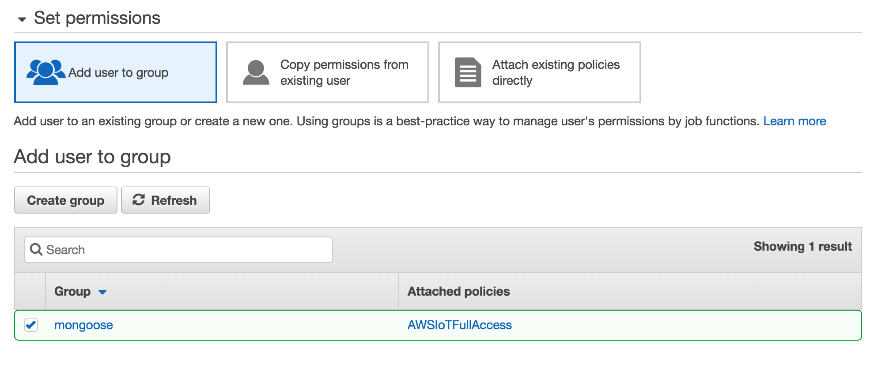

# Sette opp utviklingsverktøy

## awscli

Vi trenger awscli for å konfigurere skytjenestene vi bruker.

[Følg instruksjonene her for å installere awscli](https://aws.amazon.com/cli/).

NB! For macOS: awscli kan også installeres med homebrew

```
brew install awscli
```

Før vi konfigurerer awscli lager vi en AWS IAM bruker.

Gå til [konsollen på AWS](https://console.aws.amazon.com) og søk opp IAM:



Velg `Users` i menyen til venstre og trykk på `Add user`.

Gi brukeren et navn og hak av på `Programmatic access`.

Trykk neste.

Velg `Create group` og søk opp `awsiotfullaccess`. Hak av denne og gi gruppen et navn.



Trykk neste, neste igjen, og `Create user`.

Noter ned `Access Key ID` og `Secret access key`.

For å konfigurere awscli skriver du

```
$ aws configure
```

og fører inn access key og secret key for brukeren vi lagde. Resten av verdiene kan være default-verdier.

For å bekrefte at du får koblet til AWS fra terminalen kan du skrive

```
$ aws iot list-things
{
    "things": []
}
```

